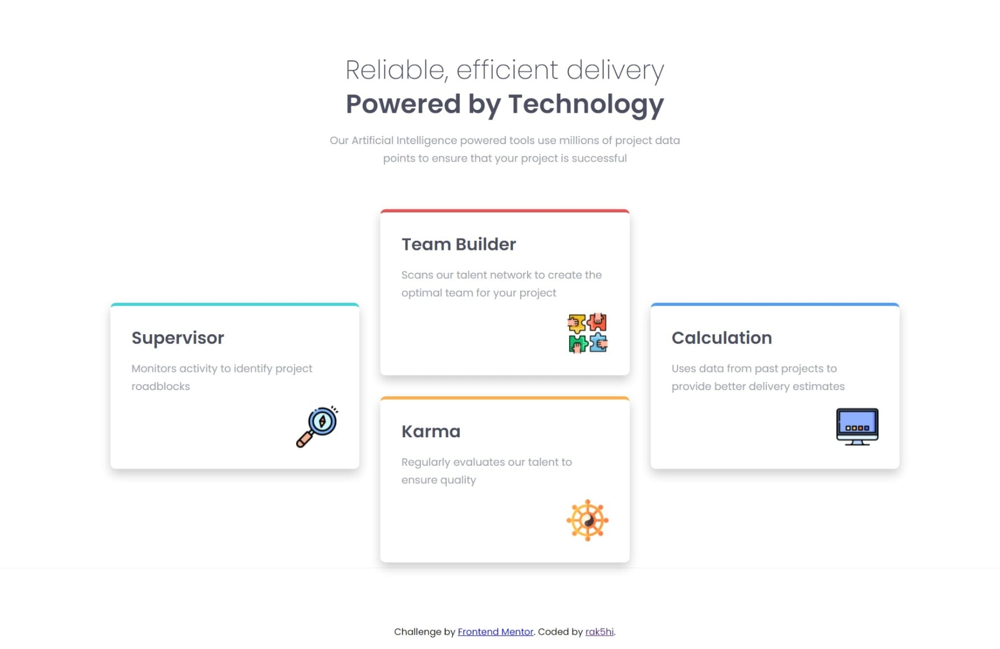

# Project Title

Four card feature section.
Coding Challenge by [Frontend Mentor](https://www.frontendmentor.io).

## Screenshot

## Description

This is a solution to the [Four card feature section challenge on Frontend Mentor](https://www.frontendmentor.io/challenges/four-card-feature-section-weK1eFYK).

Note: I used different images(/icons).

## My proccess 

### Built with

-HTML5
-CSS
-CSS Grid

### What I learned

-'<main><main/>': main tag should be used only once per html document.

### Useful resources